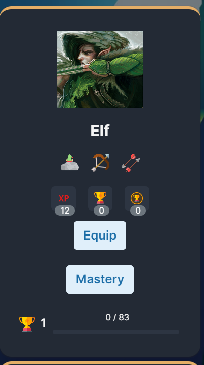
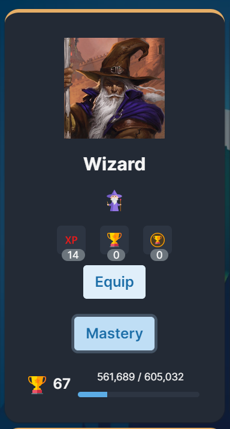

Translations for all languages supported by melvor idle have been provided with this mod, however, I only speak English & Japanese and cannot guarantee the accuracy of translations.

All translations were generated using chat gpt.

If you see an incorrect or missing translation, please create an issue on github providing the correct translation. Thank you!

https://github.com/ottotsuma/Melvor-Classes-Species
https://mod.io/g/melvoridle/m/class-species

This mod adds:

Species:
Which come with the ability to increase mastery based on their preferred skills, for the Elf below, you can see that is fletching.



Classes:



As you can see

You can add new profiles into your own mods quite easily;

First, in the setup.js you can check if this mod installed, by doing the following line of code:

```javascript I'm A tab
const profileSkill = mod.manager.getLoadedModList().includes('Class &amp; Species')
```
After checking this mod is installed, you can add the following code snippet to the JSON you will load (And change the values how you like):

In the skills section, if you add a skill by It's name the image will be added for you. When this class/species uses that skill the new profile will gain mastery exp alongside it.

```JSON I'm tab B
"data": {
"skillData": [
{
"skillID": "namespace_profile:Profile",
"data": {
"species": [
{
"id": "Human",
"name": "Human",
"media": "https://ottotsuma.github.io/images/portraits/human%20female%20barbarian%202.jpg",
"baseExperience": 5,
"productId": "namespace_profile:Human",
"level": 1,
"skills": [
"https://cdn2-main.melvor.net/assets/media/skills/thieving/man.svg",
"melvorD:Crafting"
],
"standardModifiers": [
{
"level": 0,
"key": "humanTraitApplied",
"value": 1
},
{
"level": 1,
"key": "decreasedMagicMaxHit",
"value": 10
},
{
"level": 20,
"key": "increasedDamageAgainstAnimals",
"value": 10
},
{
"level": 40,
"key": "increasedDamageAgainstHumans",
"value": 10
},
{
"level": 60,
"key": "increasedGPFromSales",
"value": 10
},
{
"level": 80,
"key": "increasedChanceForGoldFromCrafting30",
"value": 10
},
{
"level": 99,
"key": "decreasedGlobalSkillIntervalPercent",
"value": 5
}
]
}
]
}
}
}
```

                        


                                                